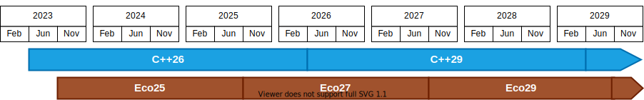

= C++ Ecosystem International Standard
:copyright: Copyright 2022 René Ferdinand Rivera Morell
:email: grafikrobot@gmail.com
:authors: René Ferdinand Rivera Morell, et al.
:audience: SG15
:revdate: {docdate}
:version-label!:
:reproducible:
:nofooter:
:sectanchors:
:sectnums:
:sectnumlevels: 5
:source-highlighter: rouge
:source-language: c++
:toc: left
:toclevels: 2
:caution-caption: ⚑
:important-caption: ‼
:note-caption: ℹ
:tip-caption: ☀
:warning-caption: ⚠
:table-caption: Table

++++

++++

Document number: :: ISO/IEC/JTC1/SC22/WG21/{revnumber}
Date: :: {revdate}
Audience: :: {audience}
Reply-to: ::
René Ferdinand Rivera Morell - _grafikrobot at gmail dot com_ - B2 Maintainer +
Ben Craig - _ben dot craig at gmail dot com_

== Abstract

We propose to publish an International Standard that specifies formats,
processes, definitions, and so on, that facilitates the interoperation of the
tools and systems that implement, and interface with, the {CPP} International
Standard (ISO/IEC 14882).

== Revision History

=== Revision 3 (June 2024)

* Remove parallel process as not relevant at this point.
* Specifies explicit steps for review process. We will follow the regular
  review of Evolution Working Group design approval and Core Wording Group for
  wording approval.
* Tweak the goals terms and order to mirror the draft outline.
* Update timeline to reflect current and near future expectations.

=== Revision 2 (February 2023)

Narrows the set of goals for the initial edition of the IS per SG15 polls. And
adds explanations of those goals.

=== Revision 1 (December 2022)

Adds proposed timeline and process for development of the IS from the first
edition onwards. Also adds "2717 Tool Introspection" as a goal for the first
edition. Add SG15 polls regarding timeline.

Include record of polls.

=== Revision 0 (October 2022)

Initial text.

== Motivation

Interoperability is a challenge in today's {CPP} ecosystem. At a time when the
{CPP} language is advancing, the community is struggling to manage the
challenges of the complexity and variability of the tools, technologies, and
systems that make {CPP} possible. In the view of users the {CPP} ecosystem is
fractured in ways that hinder its successful advancement.

The continued success of {CPP} is tied not solely to the language, but to the
{CPP} ecosystem. The interoperability within that ecosystem is key to
surmounting the challenges of further growth of the language for the benefit of
users. It is therefore critical that we expand the specifications that WG21
produces to bring coherence to the {CPP} ecosystem.

Users should be able to mix and match their preferred build systems, compilers,
linkers, package managers, static analyzers, runtime analyzers, debuggers,
profilers, etc. without needing the tools to have vendor specific knowledge of
each other. Vendors should be able to focus on direct tool improvements, rather
than figuring out how to interact with yet another proprietary interface.

== Scope

This new standard aims to clarify practice in a common
way. It can contain various aspects of the {CPP} Ecosystem:

. _Definitions_ :
We will need a common language to refer to the many components
and aspects of the ecosystem. With a shared understanding of components like:
compilers, linkers, analyzers, debuggers, package managers, preprocessors,
source files, object files, library files, shared library files, executables,
and more, we can subsequently formulate specifications for them.

. _Format Specifications_ :
The tools that make up the ecosystem work by consuming and producing a variety
of data in a variety of formats. We will need to specify those formats such that
the tools and components can operate effectively.

. _Operation Specifications_ :
It's not enough to know what the information the ecosystem contains, we
also need to specify how that data is consumed and produced to aid in
inter-operation of the variety of use cases in the {CPP} ecosystem.

This new standard will not:

. _Mandate any single vendor tools_ :
It is not a goal to seek single "blessed" tools in the ecosystem. We have a
wide variety of good tools in the ecosystem. And we look forward to those tools
cooperating with each other.

. _Prohibit vendor extensions_ :
It is not a goal to prevent vendor innovation in what the ecosystem tools can
achieve. As such we welcome extensions and look towards the advancement that
such extensions bring.

. _Modify the {CPP} Language Standard_ :
It is not a goal to alter, in any way, the {CPP} Language Standard. It is
important that how we define the tools of the {CPP} ecosystem evolves
independent of the language.

== Goals

Like the {CPP} Language Standard this one will never be complete or finished.
And it will take time and effort to provide coverage of the specifications
needed to put together a good basic picture of the ecosystem. While the scope
above defines an ideal completion, the goals for a first edition of this
standard include:

. Definitions.
. Tool introspection.
. Command line portability.
. Portable diagnostics format via SARIF.
footnote:SARIF[https://sarifweb.azurewebsites.net/[Static Analysis Results Interchange Format (SARIF)]]

NOTE: This is not a closed set of goals. It is what we think is achievable with
what we know now. We welcome additional goals if people come with complete
proposals.

=== Definitions

We will need some basic definitions as needed to circumscribe the specifications
included in this first standard.

=== Introspection

Specification of format and command options to provide implementation
information of the IS.

* P2717 Tool Introspection
footnote:[Tool Introspection. _René Ferdinand Rivera Morell_ (https://wg21.link/P2717)]

=== Portable Command Line Interface

A key aspect of interoperation between tools in the ecosystem is having a
common language to express tool commands, i.e. in compiler drivers, that can
be understood and/or translated between different tools and platforms. This
aims to define a standard structured response file format that can become the
best way to communicate compiling {CPP}.

* P3051 Structured Response Files
footnote:[Structured Response Files _René Ferdinand Rivera Morell (https://wg21.link/P3051)]

=== Diagnostics Output

{CPP} tools spend a lot of their time reading the output of other tools and
processing it to either do more work or to present it to users. Unfortunately
much of that information is not in a structured form. But instead is in plain
stream output, i.e. log and error text which takes considerable effort and is
specific to each tool generating it. Recently some tools have implemented
the common structured output as SARIF format.footnote:SARIF[]
The format is designed for presenting results of static analysis. But is
finding alternate uses. We aim to incorporate the SARIF format.

== Timeline

We believe that improving the interoperability in the {CPP} ecosystem is an
urgent problem to solve.

* We can't solve all the challenges of the ecosystem interoperation at once;
there are just too many of them.
* We need solutions sooner to show that vendors can count on a stable future
for them to build their tools on.
* We need implementations sooner to show users the value of the IS.
* We recognize that the IS will have errors that need to be addressed quickly.

Hence we aim to publish a standard quickly and provide updates to it as quickly.
The goal is to publish this new IS on a two (2) year cycle starting in 2023.
This means publishing the first edition in 2025. Subsequent versions would then
publish in 2027, 2029, and so on.

The timeline that follows lists milestones for relevant WG21 meetings.

=== 2023.2: Plan

Goal:: Finalize the plan for the development of the IS.

With the intent of keeping the first edition of the IS limited we expect to have
a rough idea of what will go into the IS by this time. SG15 will poll the plan
by the end of this meeting. From this point we will have one year (12 months)
to hone proposals to merge into the IS.

=== 2023.3: Pre-Draft

Goal:: Approve skeleton draft of the IS.

We will have a minimal skeleton draft of the IS prepared. This draft will have
one or more papers merged into it, and will have outlines for the rest of the
content, as possible. We will ask EWG approval on this content to checkpoint
the work so far and the work going forward.

=== 2024.3: Proposal

Goal:: Submit formal proposal to create work item for the publication of
the new IS.

The proposal will include an initial, mostly complete, draft of the
intended content of the IS.

NOTE: Provide for an 8 week ballot period on proposal acceptance.

=== 2025.2: Committee Draft (CD) Finalized

Goal:: Approve Committee Draft for National Body comments.

From submitting an initial draft in 2024.3 we will have completed incorporating
any detail changes that the draft text will be ready to get voted on. This will
mark, approximately, 1.5 years since the beginning of work on the new IS. The
goal at this WG21 meeting will be to address any urgent issues that could
prevent NB balloting of the IS draft.

NOTE: Provide for an 8 week ballot period on proposal acceptance.
And 2 (4?) weeks of comment compilation time.

=== 2025.3: Draft International Standard (DIS) Finalized

Goal:: Resolve collected NB comments and approve the final draft of the IS.

Consider and resolve NB comments compiled during the CD polling. With the first
IS on its way to publishing approval we can start discussions on what the
process and content will be going forward.

From here we can start the ongoing two (2) year cycles of releasing updates to
the IS. In comparison to the C++ IS that would look like:

== Process

The development and review process should follow the usual 3-stage pipeline:

. Design and wording pre-review occurs in Tooling (SG15).
. Design review approval happens in Core Language Evolution (EWG).
. Wording review and approval is managed by Core Language Wording (CWG).

=== Train Model

Like the {CPP} process we are going to follow the train model of releases. That
is, we will release what we have now not what we could have in the future.

== Polls

=== SG15: P2656R2 (2024-06-23)

_Remove the proposed parallel process from the process section._

Unanimous Consent

_Forward the initial set of Ecosystem IS papers (P2656, P3342, P3051, and
P2717), with the agreed changes, to EWG with the request to create a work item._

[options="header,autowidth",cols="^0,^0,^0,^0,^0"]
|===
| SF | F | N | A | SA
|  8 | 0 | 0 | 0 | 0
|===

=== SG15: P2656R1 (2023-02-10)

_SG15 thinks that the initial Ecosystem IS should include recommended /
recognized file extensions._

[options="header,autowidth",cols="^0,^0,^0,^0,^0"]
|===
| SF | F | N | A | SA
|  3 | 4 | 3 | 0 | 0
|===

_SG15 is interested in a structured diagnostics format in the initial Ecosystem
IS._

[options="header,autowidth",cols="^0,^0,^0,^0,^0"]
|===
| SF | F | N | A | SA
|  6 | 3 | 1 | 0 | 0
|===

=== SG15: P2656R1 (2022-12-16)

_SG15 recommends a two year timeline for the tooling IS as described in
D2656R1._

[options="header,autowidth",cols="^0,^0,^0,^0,^0"]
|===
| SF | F | N | A | SA
|  1 | 5 | 4 | 0 | 0
|===

*Author*: SF

_SG15 recommends a three year timeline for the tooling IS offset from the C++
Language IS._

[options="header,autowidth",cols="^0,^0,^0,^0,^0"]
|===
| SF | F | N | A | SA
|  0 | 5 | 4 | 0 | 0
|===

*Author*: F

=== EWG: P2656R0 (2022-11-10)

_EWG is in favor of further work in the direction of starting an additional IS
for Tooling Interaction as proposed by P2656, and would like to see this again
with a proposed scope, process, details, etc._

[options="header,autowidth",cols="^0,^0,^0,^0,^0"]
|===
| SF | F | N | A | SA
| 29 | 6 | 1 | 0 | 0
|===

*Result*: strong consensus

=== SG15: P2656R0 (2022-11-09)

_SG15 recommends to WG21 to create a new Tooling IS with the scope and goals
described in P2656R0 when an approved working document has been produced._

[options="header,autowidth",cols="^0,^0,^0,^0,^0"]
|===
| SF | F | N | A | SA
| 13 | 3 | 4 | 0 | 0
|===

*Result*: pretty strong consensus

*Author*: SF

*Attendance*: 20
